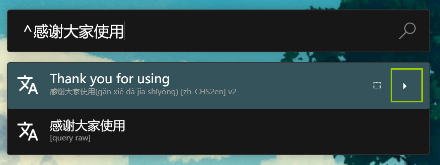
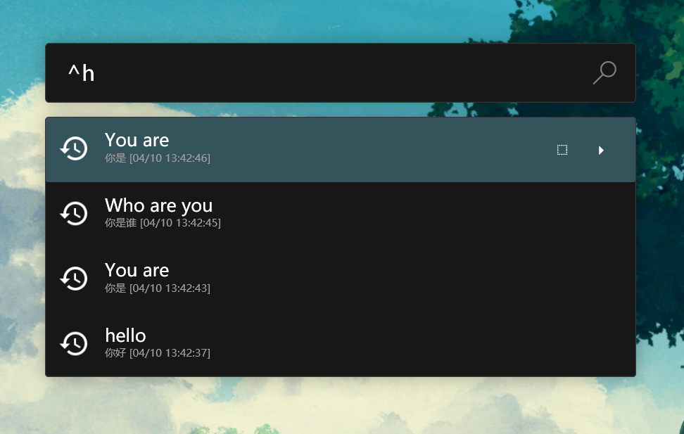
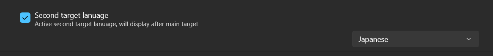
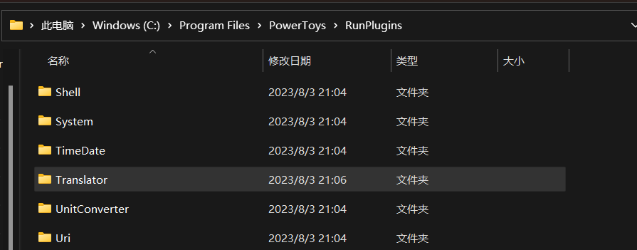
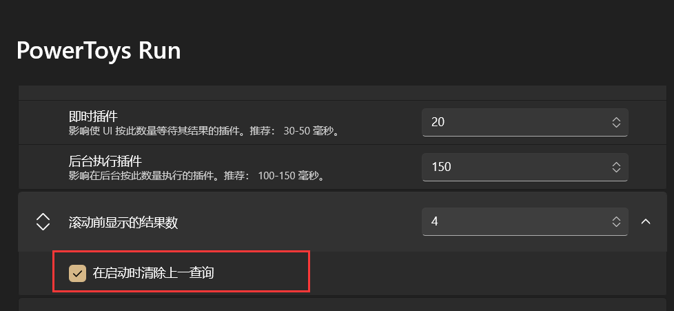
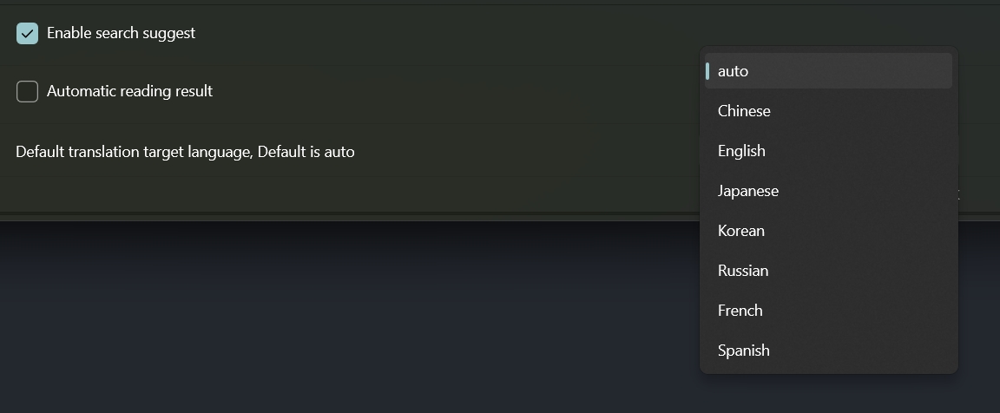

<h1>PowerTranslator</h1>

A translation plugin for <a href=https://github.com/microsoft/PowerToys>PowerToys Run</a>, fast and stable.

   

[中文](./readme.md)

## About

A plugin for [PowerToys Run](https://github.com/microsoft/PowerToys).

The plugin has been updated to use Youdao translation, which supports translation for all languages supported by Youdao translation.

- [how to use](#usage)
- [how to install](#install)
- [settings](#setting)
- [submit issue](#issue)

## Usage

- The default trigger key is `|`. 

  - Press `alt+space` to open PowerToys Run, and enter `^[text to be translated]`.
  - Press `Enter` to copy the translation result to the clipboard.

  Demo of translating 'command'
  

  Demo of translating '命令'
  

- Chinese with pinyin:
  Refer to the above demo for translating '命令'.

- Quickly translate the clipboard:

  - When there is text in the clipboard, simply type the trigger keyword `^` to quickly translate the content in the clipboard.

    

- Specify the target language of translation:

  - Use `^[words]->[target language]`, for example, `^你好->ja` means translate '你好' into Japanese.
    
    Common language codes:
    |Language|Code|Note|
    |---------|------|-|
    |Chinese(Simplified) | zh-CHS | Simplified Chinese
    |Chinese(Traditional) | zh-CHT| Traditional Chinese
    |Japanese |ja| Japanese
    |English |en| English
    |Korean |ko| 한국어
    |French |fr| En français
    |Russian |ru| русск

- Search suggestions:

  - Search content according to the current input suggestions.
    
  - You can choose whether to enable suggestions in the settings, corresponding to `Enable search suggest`.

- Read content:

  - Supports reading Chinese and English (shortcut key ctrl+enter).
    
  - Based on Youdao TTS interface.
  - Supports automatic reading of results function, which is **off by default** and can be turned on in the settings, corresponding to `Automatic reading result`.

- History record:

  - Typing `h` or having no translation target in the clipboard will display translation history.
    
  - Default **15** records.
  - **Why doesn't it support customizing the upper limit entry?**
    Because the official only provides a bool type custom parameter, the current version does not support customizing the upper limit of translation history. I will update it when it is supported later. Or you can download the source code and modify it yourself.

- Second Language
  - Enable the second translation target language, disabled by default
  
  - When enabled, the second language result will be automatically displayed with each translation
  

## Install

1. Close PowerToys.
2. Download [Translator.zip](https://github.com/N0I0C0K/PowerTranslator/releases).
3. Extract it to `%LOCALAPPDATA%\Microsoft\PowerToys\PowerToys Run\Plugins`.
   As shown in the figure:
   
4. Start PowerToys.

Refer to official documents, [Third-Party plugins for PowerToy Run](https://github.com/microsoft/PowerToys/blob/main/doc/thirdPartyRunPlugins.md)

[Installation-upgrade detailed tutorial](./doc/how%20to%20install.md)

## Setting

- If there is a trigger key conflict, modify the default trigger key (it is recommended to modify it to "`" and check for conflicts).
  
- It is recommended to check `Clear previous query at startup`, which can solve the problem that clipboard quick translation cannot be triggered.
  
- It is recommended to check `Smooth input`, which can optimize the input experience.
  
- Toggles the default target translation language, which defaults to 'auto'
  
## Issue

If you find translation failure, unknown errors, or need new features, please submit an issue. I will fix or improve it in time.

## Contribution

### Environment

- .NET SDK

### Preparation

1. Fork this repository.
2. Clone the forked repository to your local machine.
3. Run lib.bat.
4. Open with Visual Studio Code (or any other IDE).
5. Start coding!

[Help Document - Getting Started!](doc/code-start-en.md)
